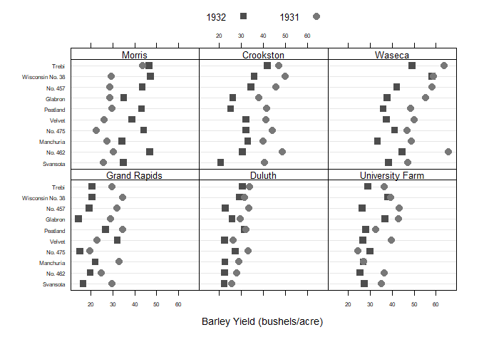
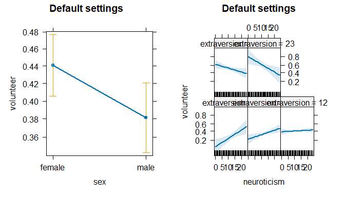
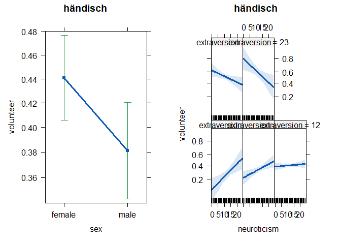
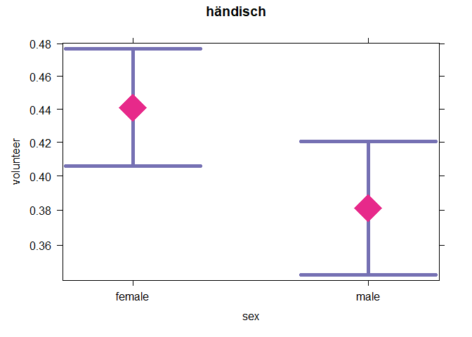
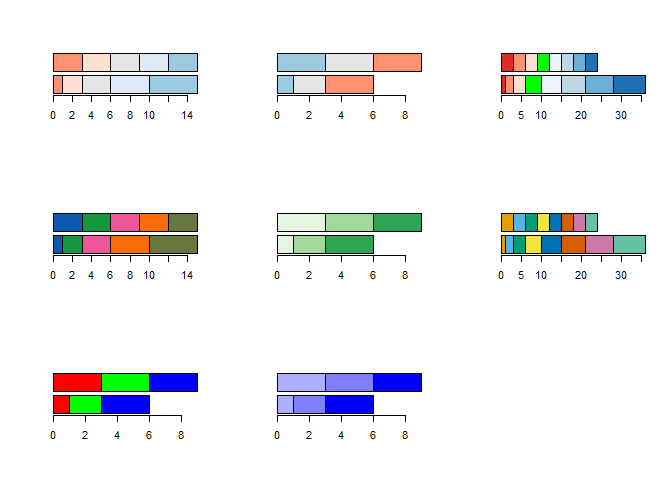

stp25settings
================

- Settings: set_opt(), get_opt(), default_stp25()

- Graphical Parameters for Lattice bw_theme(), standard_theme(),
  ggplot_theme(), reset_lattice(), set_lattice()

- Colors: farbe(), likert_col()

- Output: which_output()

## Default stp25 Options

    language = "de"
    output =  ""
    fig_folder = "Fig/"
    html_folder = "Results/"

    sep_element = ", "
    brackets = c("[", "]")

    prozent = list(digits=0, style=1, ...)
    mittelwert = list(digits=2, median.style="IQR", plusmin_sign=FALSE, ...)
    Fstat = list(digits=2, ...)
    r = list(digits=2, ...)
    r2 = list(digits=2, ...)
    p = list(digits=3, with.stars=FALSE, ...)

``` r
 set_opt(
   p = list(digits = 2, mark.sig = TRUE),
   prozent = list(digits = 0, null_percent_sign =  ' . ')
 )
 get_opt("prozent")
# $digits
# [1] 0
# 
# $lead.zero
# [1] TRUE
# 
# $style
# [1] 1
# 
# $percentage_str
# [1] "%"
# 
# $null_percent_sign
# [1] " . "
# 
# $include_name
# [1] ""
# 
# $include_level_multi
# [1] TRUE
# 
# $exclude
# [1] NA
 
 get_opt()$p$digits
# [1] 2
```

| Item         | m               |
|:-------------|:----------------|
| \(N\)        | 32              |
| mpg (mean)   | 20.09 (6.03)    |
| cyl (median) | 6.00 (IQR 4.00) |
| disp (mean)  | 230.72 (123.94) |
| vs           |                 |
| 0            | 56% (18)        |
| 1            | 44% (14)        |

### which_output()

return values are: “text”, “latex”, “html”, “markdown_html”, “markdown”,
“pandoc”, und “rst”

Ausgabe mit Output

- text: print()
- latex: kableExtra::kable_styling() und knitr::kable()
- html und markdown_html: htmlTable::htmlTable()
- pandoc und rst: knitr::kable()
- word: flextable::regulartable()

``` r
knitr:::out_format()
# [1] "markdown"
knitr::pandoc_to()
# [1] "gfm"
which_output()
# [1] "markdown_html"
```

## lattice options

``` r
set_opt(fig_folder ="Grafiken")
get_opt("fig_folder")
# [1] "Grafiken/"
farbe("pirat")
#       blue1       green        pink      orange      green1 
# "#0C5BB0FF" "#15983DFF" "#EC579AFF" "#FA6B09FF" "#667840FF"
```

``` r
# lattice::trellis.par.set(bw_theme)
update(
  dotplot(
    variety ~ yield | site,
    data = barley,
    groups = year,
    #  key = simpleKey(levels(barley$year), space = "right"),
    auto.key = list(space = "top", columns=2),
    xlab = "Barley Yield (bushels/acre) ",
    # aspect=0.5, layout = c(1,6),
    ylab = NULL
  ),
 # par.strip.text = list(lines = 2.5, cex=1.5, col = 6),
  par.settings = bw_theme(
  cex.symbol =  1.2,
  cex.xlab = .85,
  cex.axis = .5
  )
)
```



## Effect-plots

Effect-plots sind eine Variante der `lattice::xyplots`

``` r
require(effects)
effects::effectsTheme()
# $strip.background
# $strip.background$col
# [1] "#F2F2F2" "#B9B9B9" "#808080"
# 
# 
# $strip.shingle
# $strip.shingle$col
# [1] "black"
# 
# 
# $clip
# $clip$strip
# [1] "off"
# 
# 
# $superpose.line
# $superpose.line$lwd
# [1] 2 1 1 1 1 1 1
# 
# 
# attr(,"current")
# attr(,"current")$strip.background
# attr(,"current")$strip.background$alpha
# [1] 1
# 
# attr(,"current")$strip.background$col
# [1] "gray95" "gray95" "gray95" "gray95" "gray95" "gray95"
# [7] "gray95"
# 
# 
# attr(,"current")$strip.shingle
# attr(,"current")$strip.shingle$alpha
# [1] 1
# 
# attr(,"current")$strip.shingle$col
# [1] "gray70" "gray70" "gray70" "gray70" "gray70" "gray70"
# [7] "gray70"
# 
# 
# attr(,"current")$clip
# attr(,"current")$clip$panel
# [1] "on"
# 
# attr(,"current")$clip$strip
# [1] "on"
# 
# 
# attr(,"current")$superpose.line
# attr(,"current")$superpose.line$alpha
# [1] 1
# 
# attr(,"current")$superpose.line$col
#          blue        orange   bluishgreen    vermillion 
#     "#0072B2"     "#E69F00"     "#009E73"     "#D55E00" 
#       skyblue        yellow reddishpurple 
#     "#56B4E9"     "#F0E442"     "#CC79A7" 
# 
# attr(,"current")$superpose.line$lty
# [1] 1 1 1 1 1 1 1
# 
# attr(,"current")$superpose.line$lwd
# [1] 1 1 1 1 1 1 1
```

``` r
mod.cowles <- glm(volunteer ~ sex + neuroticism*extraversion,data=Cowles, family=binomial)

lattice::trellis.par.set(effectsTheme())
plot(allEffects(mod.cowles), main="Default settings")
```



``` r

lattice::trellis.par.set(bw_theme())
plot(allEffects(mod.cowles), main="bw_theme")
```


``` r
lattice::trellis.par.set(
  effects::effectsTheme(
    superpose.line = list(lwd = c(3, rep(1, 6))),
    col = farbe()
  ))
```

### Margins einstellen

``` r

# axis.padding<- lattice::lattice.getOption("axis.padding")
# layout.heights <- lattice::lattice.getOption("layout.heights")
# layout.widths <- lattice::lattice.getOption("layout.widths")

lattice::lattice.options(
  layout.widths=
    list(
      left.padding=list(x=.4), 
      right.padding=list(x=1)
    ),
  axis.padding =list(numeric=0.3)
)
plot(allEffects(mod.cowles), main="händisch" , 
     lattice = list(cex=5)
     )
```



``` r

# lattice::lattice.options(layout.widths =layout.widths,
#                 axis.padding= axis.padding)
```

### Effect-Plot Händisch

Das geht nur händich

``` r

as.data.frame(effect("sex", mod.cowles))
#      sex       fit         se     lower     upper
# 1 female 0.4409440 0.01815204 0.4057279 0.4767645
# 2   male 0.3811939 0.01967564 0.3434476 0.4204322

p1 <- plot(effect("sex", mod.cowles), main = "händisch")
update(
  p1,
  panel = function(x, y, lower, upper, has.se, ...) {
    larrows(
      x0 = x, y0 = lower,
      x1 = x, y1 = upper,
      angle = 90,  code = 3,
      col = "#7570B3",
      length = 1,
      lwd = 5
    )
    
    panel.xyplot(
      x, y,
     cex = 5,
     pch = 18,
     col =  "#E7298A",)
  }
  )
```



## Usage

``` r

require(stp25stat2)
require(stp25output2)

#' mittelwert und mean sind die selben arameter

set_opt(
  mean = list(digits=4, plusmin_sign=TRUE),
  p = list(digits = 3, mark.sig = TRUE),
  prozent = list(digits = 2, style=2 )
 # fig_folder = "Fig_folder/ihztrö%$g_l (-.2/",
  # data_folder = "Raw data/",
 # html_folder = "Results2/"
)


#Projekt("html", "test")
mtcars2 <- mtcars
mtcars$vs <- factor(mtcars$vs)

#get_opt("prozent")
mtcars %>% Tbll_desc (
  mpg[mean],
  cyl[median,0],
  disp,
  vs
) %>% Output("Hallo")
```

<table class="gmisc_table" style="border-collapse: collapse; padding-left: .5em; padding-right: .2em;">
<thead>
<tr>
<td colspan="2" style="text-align: left;">
Tab 1: Hallo
</td>
</tr>
<tr>
<th style="font-weight: 900; border-bottom: 1px solid black; border-top: 2px solid black; text-align: center;">
Item
</th>
<th style="font-weight: 900; border-bottom: 1px solid black; border-top: 2px solid black; text-align: center;">
m
</th>
</tr>
</thead>
<tbody>
<tr>
<td style="padding-left: .5em; padding-right: .2em; text-align: left;">
(N) 
</td>
<td style="padding-left: .5em; padding-right: .2em; text-align: left;">
32
</td>
</tr>
<tr>
<td style="padding-left: .5em; padding-right: .2em; text-align: left;">
mpg (mean)
</td>
<td style="padding-left: .5em; padding-right: .2em; text-align: left;">
20.0906 (6.0269)
</td>
</tr>
<tr>
<td style="padding-left: .5em; padding-right: .2em; text-align: left;">
cyl (median)
</td>
<td style="padding-left: .5em; padding-right: .2em; text-align: left;">
6 (IQR 4)
</td>
</tr>
<tr>
<td style="padding-left: .5em; padding-right: .2em; text-align: left;">
disp (mean)
</td>
<td style="padding-left: .5em; padding-right: .2em; text-align: left;">
230.7219 (123.9387)
</td>
</tr>
<tr>
<td style="padding-left: .5em; padding-right: .2em; text-align: left;">
vs 
</td>
<td style="padding-left: .5em; padding-right: .2em; text-align: left;">
</td>
</tr>
<tr>
<td style="padding-left: .5em; padding-right: .2em; text-align: left;">
 0
</td>
<td style="padding-left: .5em; padding-right: .2em; text-align: left;">
18 (56.25%)
</td>
</tr>
<tr>
<td style="padding-left: .5em; padding-right: .2em; border-bottom: 2px solid black; text-align: left;">
 1
</td>
<td style="padding-left: .5em; padding-right: .2em; border-bottom: 2px solid black; text-align: left;">
14 (43.75%)
</td>
</tr>
</tbody>
<tfoot>
<tr>
<td colspan="2">
</td>
</tr>
</tfoot>
</table>

``` r
farbe()
#       blue1       green        pink      orange      green1 
# "#0C5BB0FF" "#15983DFF" "#EC579AFF" "#FA6B09FF" "#667840FF"
farbe("Reds")
#     Reds1     Reds2     Reds3     Reds4     Reds5 
# "#FEE5D9" "#FCAE91" "#FB6A4A" "#DE2D26" "#A50F15"

#' 00       0 Prozent
#' 40       25 Prozent
#' 80       50 Prozent
#' C0       75 Prozent
#' FF       100 Prozent


farbe(n=2)
#       blue1       green 
# "#0C5BB0FF" "#15983DFF"
farbe("Reds")
#     Reds1     Reds2     Reds3     Reds4     Reds5 
# "#FEE5D9" "#FCAE91" "#FB6A4A" "#DE2D26" "#A50F15"

farbe("likert", 7, name="RdBl", middle.color= "#00FF00")
#        Reds3        Reds2        Reds1 middle.color 
#    "#DE2D26"    "#FC9272"    "#FEE0D2"    "#00FF00" 
#       Blues1       Blues2       Blues3 
#    "#DEEBF7"    "#9ECAE1"    "#3182BD"
```

``` r
par(mfrow=c(3,3))
barplot(cbind(1:5, rep(3,5)), horiz = TRUE, 
        col=farbe("likert", 5, name="RdBl"))
barplot(cbind(1:3, rep(3,3)), horiz = TRUE, 
        col=farbe("likert", 3, name="BlRd"))
barplot(cbind(1:8, rep(3,8)), horiz = TRUE, 
        col=farbe("likert", 8, name="RdBl", middle=4,  middle.color= "#00FF00"))

barplot(cbind(1:5, rep(3,5)), horiz = TRUE, 
        col=farbe("pirat", 5))
barplot(cbind(1:3, rep(3,3)), horiz = TRUE, 
        col=farbe("Greens", 3))
barplot(cbind(1:8, rep(3,8)), horiz = TRUE, 
        col=farbe("color.blinde", 8))


barplot(cbind(1:3, rep(3,3)), horiz = TRUE, 
        col= c( "#FF0000",  "#00FF00", "#0000FF"))
barplot(cbind(1:3, rep(3,3)), horiz = TRUE, 
        col= c( "#0000FF50",  "#0000FF80", "#0000FFFF"))
```


